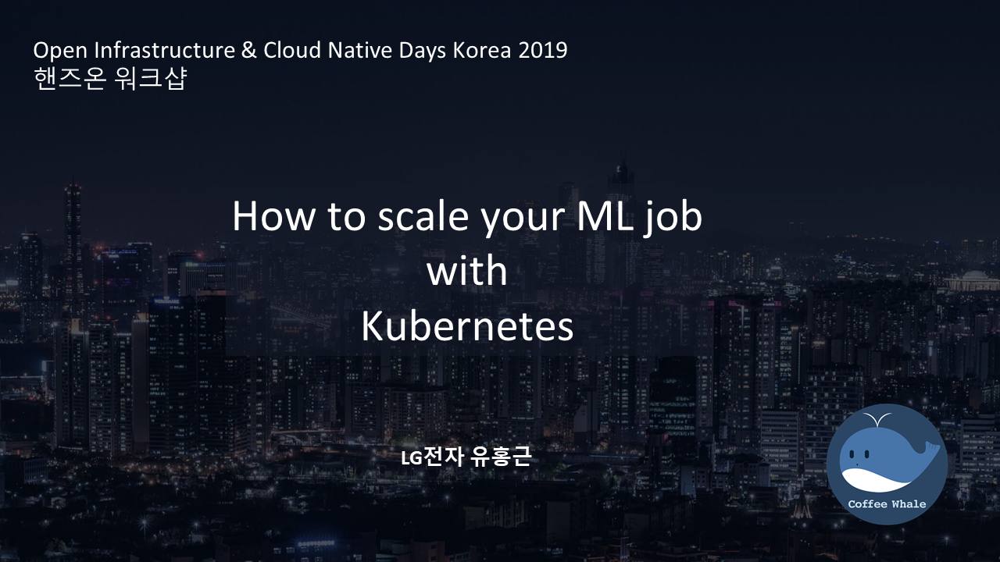
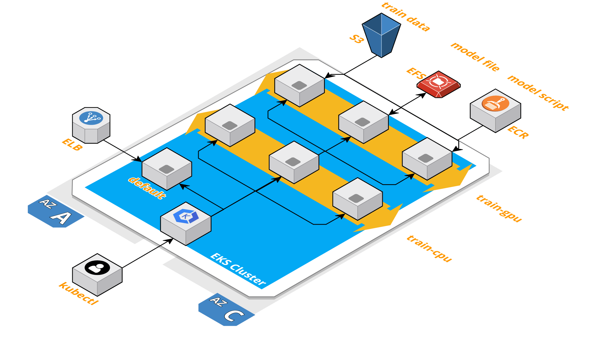
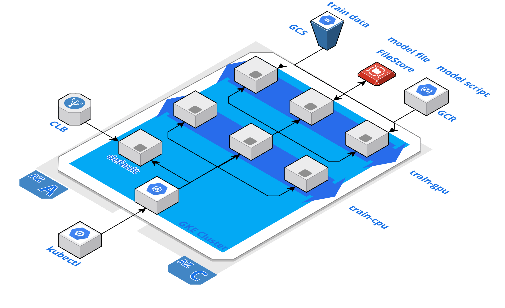

# Open Infrastructure & Cloud Native Days Korea 2019 Track 7

*Hands-on session*

How to scale your ML job with Kubernetes

## 워크샵 순서
1. [Why Kubernetes? (간략 소개)](#1-why-kubernetes)
2. Provisioning K8S (핸즈온)
    - [on AWS](#on-aws)
    - [on GPC](#on-gcp)
3. How to scale your ML job (핸즈온)
    - A
    - B

## Prequisition
- AWS 계정 or GCP 계정
- Kubernetes 기본 지식
  - Deployments
  - Services
  - Jobs
  - PersistentVolumeClaims

## 1. Why Kubernetes?

2019 AWS summit Seoul에서 발표한 "Amazon EKS를 활용하여 기계학습 서버 확장하기"를 토대로 워크샵을 진행합니다.
- [slide](https://www.slideshare.net/awskorea/amazon-eks-lg-aws-summit-seoul-2019)
- [video](https://www.youtube.com/watch?v=egv2TlfLL1Y&list=PLORxAVAC5fUXSZaun-15IvzUhO3YmvtdV)

[워크샵 발표 내용](whyk8s.pdf) (사내 검토 중)


## 2. Provisioning K8S

Production 환경에서 제대로 클러스터를 구축한다면 private k8s 구축 및 도메인 네임 설정 & Ingress 설정을 해야하지만 본 워크샵에서는 생략하도록 하겠습니다.

### On AWS


사용할 리소스
- EKS: k8s 마스터
- EC2: kubectl 명령 서버, worker 노드
- ELB: Ingress
- ECR: ML scripts
- EFS: 모델 저장소
- S3: 학습 데이터
- VPC: default VPC

#### 설치 목록

##### eksctl
[eksctl](https://github.com/weaveworks/eksctl)은 weaveworks에서 개발한 Amazon EKS CLI 툴입니다. 재밌는 것은 이것은 AWS에서 만든 것이 아니라 Kubernetes Network Provider중 하나인 weavenetwork를 만든 회사(Weaveworks)라는 회사에서 개발했다는 점입니다. 오늘 AWS 플랫폼 위에서는 eksctl을 이용하여 k8s 클러스터를 구축할 예정입니다.

##### aws-iam-authenticator
[aws-iam-authenticator](https://github.com/kubernetes-sigs/aws-iam-authenticator)도 마찬가지로 재밌는 사실은 원래는 heptio라는 회사에서 개발한 IAM 권한 획득 툴입니다. 현재는 kubernetes-sigs(special interest group)에서 관리합니다.
EKS는 기본적으로 AWS IAM을 이용하여 k8s RBAC과 연동합니다. 이때 필요한 것이 aws-iam-authenticator라는 녀석입니다.  


##### kubectl
[kubectl](https://kubernetes.io/docs/tasks/tools/install-kubectl/)은 쿠버네티스 마스터와 대화할 수 있는 CLI툴입니다.

##### helm
[helm](https://helm.sh/)이란 쿠버네티스 package manager입니다. 해당 툴을 이용하여 필요한 모듈들을 쿠버네티스에 설치할 수 있습니다. apt, yum, pip 툴들과 비슷한 녀석이라고 생각하시면 됩니다.
오늘 helm을 통해서 Distributed ML job에 필요한 패키지들을 설치해볼 예정입니다.

##### helm chart
helm chart는 helm을 통해 설치하는 패키지 레포지토리를 말합니다. 오늘은 다음 chart들을 설치해볼 예정입니다.
- argo workflow: Data pipeline & ML workflow를 실행 시켜줄 wf engine입니다.
- nfs-client-provisioner: NAS 서버(EFS)와 연결 시켜주는 Storage Provisioner입니다.
- minio: NAS 서버를 웹으로 통해 볼 수 있게 minio UI를 사용합니다.
- cluster-autoscaler: 요청한 자원 만큼 서버 리소스를 늘려주는 k8s autoscaler입니다.
- metrics-server: 서버의 리소스 사용량을 확인하는 패키지입니다. (kubectl top node)

#### IAM User 생성 및 권한 부여
1. EKS Admin policy 생성

- *IAM 접속 - Policies - Create policy - JSON*
```json
{
  "Version": "2012-10-17",
  "Statement": [
    {
      "Sid": "VisualEditor0",
      "Effect": "Allow",
      "Action": [
          "ecr:*",
          "ec2:*",
          "eks:*",
          "iam:*",
          "s3:*",
          "elasticfilesystem:*",
          "autoscaling:*",
          "cloudformation:*"
      ],
      "Resource": "*"
    }
  ]
}
```
**엄청 나게 강력한 권한이니 워크샵이 끝난 이후 삭제 바랍니다.**

- *Review policy*
- *Name*: EKS-admin

2. User 생성

- *User name*: k8s-ml
- *Access type*: Programmatic access
- *Next Permissions*
- *Attach existing policies directly*: EKS-admin 검색
- *Next Tags* - *Next Review* - *Create user*
- Access key, Secret key 저장

#### Setup

가장 먼저 EKS 마스터에 명령을 전달할 EC2 서버 하나를 생성합니다. 본인의 PC에서 직접 작업을 진행하셔도 무방합니다.
본 워크샵은 Ubuntu 18.04 위에서 정상적으로 동작하도록 구성이 되어 있습니다.
먼저 kubectl 명령 서버를 하나 만들겠습니다.
http://console.aws.amazon.com

```bash
# git clone
git clone https://github.com/hongkunyoo/how-to-scale-your-ml-job-with-k8s.git && cd how-to-scale-your-ml-job-with-k8s

# install jq
sudo apt-get update && sudo apt-get install -y jq apt-transport-https

# install awscli
wget https://repo.anaconda.com/miniconda/Miniconda3-latest-Linux-x86_64.sh && \
    /bin/bash Miniconda3-latest-Linux-x86_64.sh -b -p $HOME/miniconda3 && \
    rm Miniconda3-latest-Linux-x86_64.sh && \
    echo 'export PATH=$HOME/miniconda3/bin:$PATH' >> $HOME/.bashrc && \
    $HOME/miniconda3/bin/pip install awscli && \
    source $HOME/.bashrc

# AWS user configure
aws configure
# access key: XXX
# secret key: XXX
# region: ap-northeast-2

# 클러스터 이름과 리전을 설정합니다.
CLUSTER_NAME=k8s-ml


# installing eksctl
curl --location "https://github.com/weaveworks/eksctl/releases/download/latest_release/eksctl_$(uname -s)_amd64.tar.gz" | \
    tar xz -C /tmp && \
    sudo mv /tmp/eksctl /usr/local/bin

# installing heptio-authenticator
curl -o aws-iam-authenticator https://amazon-eks.s3-us-west-2.amazonaws.com/1.11.5/2018-12-06/bin/linux/amd64/aws-iam-authenticator && \
    chmod +x ./aws-iam-authenticator && \
    sudo mv aws-iam-authenticator /usr/local/bin

# installing kubectl
curl -s https://packages.cloud.google.com/apt/doc/apt-key.gpg | sudo apt-key add - && \
    echo "deb https://apt.kubernetes.io/ kubernetes-xenial main" | sudo tee -a /etc/apt/sources.list.d/kubernetes.list && \
    sudo apt-get update && \
    sudo apt-get install -y kubectl

# Create k8s cluster
eksctl create cluster --name $CLUSTER_NAME --without-nodegroup

# default worker node 구성
eksctl create nodegroup --cluster $CLUSTER_NAME --name default --nodes-min 1 --nodes-max 1 --nodes 1 --node-labels "role=default" --node-type m5.xlarge --asg-access

# CPU worker node 구성
eksctl create nodegroup --cluster $CLUSTER_NAME --name train-cpu --nodes-min 1 --nodes-max 3 --nodes 2 --node-labels "role=train-cpu" --node-type c5.xlarge --asg-access

# GPU worker node 구성
eksctl create nodegroup --cluster $CLUSTER_NAME --name train-gpu --nodes-min 0 --nodes-max 1 --nodes 0 --node-labels "role=train-gpu" --node-type p3.2xlarge --asg-access

NG_STACK=eksctl-$CLUSTER_NAME-nodegroup-train-gpu
ASG_ID=$(aws cloudformation describe-stack-resource --stack-name $NG_STACK --logical-resource-id NodeGroup --query StackResourceDetail.PhysicalResourceId --output text)
REGION=$(aws configure get region)

aws autoscaling create-or-update-tags --tags ResourceId=$ASG_ID,ResourceType=auto-scaling-group,Key=k8s.io/cluster-autoscaler/node-template/label/role,Value=train-gpu,PropagateAtLaunch=true

# 클러스터 확인
kubectl get node -L role

# Create EFS filesystem
FS_ID=$(aws efs create-file-system --creation-token $CLUSTER_NAME | jq -r .FileSystemId)

# Manage file system access
# AWS console

# Create S3 bucket
BUCKET_NAME=k8s-ml-$(echo $(curl -s "https://helloacm.com/api/random/?n=5&x=2")| tr -d \")
aws s3 mb s3://$BUCKET_NAME

# installing helm client
curl https://raw.githubusercontent.com/helm/helm/master/scripts/get | bash

# RBAC setting
cat <<EOF | kubectl create -f -
apiVersion: rbac.authorization.k8s.io/v1
kind: ClusterRoleBinding
metadata:
  name: default-admin
roleRef:
  apiGroup: rbac.authorization.k8s.io
  kind: ClusterRole
  name: cluster-admin
subjects:
- kind: ServiceAccount
  name: default
  namespace: kube-system
EOF

# installing helm
helm init --service-account default
```

```bash
# before installing helm chart, change values
vi charts/nfs-client-provisioner/values.yaml
```

```yaml
# line 14
nfs:
  server: !(FS_ID).efs.ap-northeast-2.amazonaws.com
```

```bash
vi charts/minio/values.yaml
```

```yaml
# line 45
efsFileSystemId: !(FS_ID)
```

```bash
# install helm charts
helm install charts/argo-workflow --namespace kube-system
helm install charts/nfs-client-provisioner --namespace kube-system
helm install charts/minio --namespace kube-system
helm install charts/cluster-autoscaler --namespace kube-system
helm install charts/metrics-server --namespace kube-system

# Apply NVIDIA plugin
kubectl apply -f https://raw.githubusercontent.com/NVIDIA/k8s-device-plugin/v1.11/nvidia-device-plugin.yml

# check all chart is running
kubectl get pod -n kube-system

# Create model storage PVC
cat <<EOF | kubectl create -f -
apiVersion: v1
kind: PersistentVolumeClaim
metadata:
  name: model-storage
spec:
  accessModes:
  - ReadWriteMany
  resources:
    requests:
      storage: 10Gi
  storageClassName: nfs-client
EOF

echo "This is your ECR repository: "$(aws sts get-caller-identity | jq -r .Account).dkr.ecr.ap-northeast-2.amazonaws.com/\$IMAGE_NAME
```

---

#### On GCP


사용할 리소스
- GKE: k8s 마스터
- GCE: worker 노드
- CLB: Ingress
- GCR: ML scripts
- FileStore: 모델 저장소
- GCS: 학습 데이터

#### 설치 목록

GCP에서는 Cloud Console이라는 훌륭한 콘솔이 기본적으로 제공되고 대부분 이미 설치가 되어 있기 때문에 필요한 helm chart만 바로 설치하면 됩니다.
##### helm chart
- argo workflow: Data pipeline & ML workflow를 실행 시켜줄 wf engine입니다.
- nfs-client-provisioner: NAS 서버(EFS)와 연결 시켜주는 Storage Provisioner입니다.
- minio: NAS 서버를 웹으로 통해 볼 수 있게 minio UI를 사용합니다.
- ~~cluster-autoscaler~~: GCP 자체적으로 autoscale을 지원합니다. 단점은 세부적인 option 설정이 불가능합니다.
- ~~metrics-server~~: GKE를 생성할때 metrics-server 설치 옵션을 넣으주면 자동으로 설치되어서 나옵니다.


https://console.cloud.google.com 접속
```bash
git clone https://github.com/hongkunyoo/how-to-scale-your-ml-job-with-k8s.git && cd how-to-scale-your-ml-job-with-k8s

gcloud components update

gcloud config set compute/zone us-central1-a

CLUSTER_NAME=k8s-ml

gcloud container clusters create $CLUSTER_NAME \
    --num-nodes=1 \
    --node-labels=role=default \
    --machine-type=n1-standard-4 \
    --node-locations=us-central1-a,us-central1-b


gcloud container node-pools create train-cpu \
    --cluster $CLUSTER_NAME \
    --node-labels=role=train-cpu \
    --enable-autoscaling \
    --min-nodes=1 \
    --num-nodes=2 \
    --max-nodes=3 \
    --machine-type=n1-highcpu-8

gcloud container node-pools create train-gpu \
    --cluster $CLUSTER_NAME \
    --node-labels=role=train-gpu \
    --enable-autoscaling \
    --min-nodes=0 \
    --num-nodes=0 \
    --max-nodes=1 \
    --machine-type=n1-highmem-2

# 클러스터 확인
kubectl get node -L role

BUCKET_NAME=k8s-ml-$(echo $(curl -s "https://helloacm.com/api/random/?n=5&x=2")| tr -d \")
gutils mb gs://$BUCKET_NAME

# installing helm client
curl https://raw.githubusercontent.com/helm/helm/master/scripts/get | bash

# RBAC setting
cat <<EOF | kubectl create -f -
apiVersion: rbac.authorization.k8s.io/v1
kind: ClusterRoleBinding
metadata:
  name: default-admin
roleRef:
  apiGroup: rbac.authorization.k8s.io
  kind: ClusterRole
  name: cluster-admin
subjects:
- kind: ServiceAccount
  name: default
  namespace: kube-system
EOF

# installing helm
helm init --service-account default

# Create Cloud FileStore
gcloud filestore instances create nfs-server \
    --project=$DEVSHELL_PROJECT_ID \
    --file-share=name="vol1",capacity=1TB \
    --zone=us-central1-a \
    --network=name="default",reserved-ip-range="10.0.0.0/29"

# install helm charts
helm install charts/argo-workflow --namespace kube-system
helm install charts/nfs-client-provisioner --namespace kube-system
helm install charts/minio --namespace kube-system

kubectl apply -f https://raw.githubusercontent.com/NVIDIA/k8s-device-plugin/v1.11/nvidia-device-plugin.yml
kubectl get pod -n kube-system
```

### 3. How to scale your ML job

#### Run ML jobs

1. Basic Job

```yaml
apiVersion: batch/v1
kind: Job
metadata:
  name: exp01-example
spec:
  template:
    spec:
      containers:
      - name: ml
        image: hongkunyoo/eks-ml:example
        imagePullPolicy: Always
        command: ["python", "train.py"]
        args: ['5', 'softmax', '0.5']
        resources:
          requests:
            cpu: "0.5"
            memory: "3Gi"
          limits:
            cpu: "1"
            memory: "5Gi"
      restartPolicy: Never
  backoffLimit: 0
```

#### Build Data Pipeline

1. Workflow hello world

```yaml
apiVersion: argoproj.io/v1alpha1
kind: Workflow                  # new type of k8s spec
metadata:
  generateName: hello-world-    # name of the workflow spec
spec:
  entrypoint: whalesay          # invoke the whalesay template
  templates:
  - name: whalesay              # name of the template
    container:
      image: docker/whalesay
      command: [cowsay]
      args: ["hello world"]
      resources:                # limit the resources
        limits:
          memory: 32Mi
          cpu: 100m
```

2. Multi step Data Pipeline

```yaml
apiVersion: argoproj.io/v1alpha1
kind: Workflow
metadata:
  generateName: steps-
spec:
  entrypoint: hello-hello-hello

  # This spec contains two templates: hello-hello-hello and whalesay
  templates:
  - name: hello-hello-hello
    # Instead of just running a container
    # This template has a sequence of steps
    steps:
    - - name: hello1            # hello1 is run before the following steps
        template: whalesay
        arguments:
          parameters:
          - name: message
            value: "hello1"
    - - name: hello2a           # double dash => run after previous step
        template: whalesay
        arguments:
          parameters:
          - name: message
            value: "hello2a"
      - name: hello2b           # single dash => run in parallel with previous step
        template: whalesay
        arguments:
          parameters:
          - name: message
            value: "hello2b"

  # This is the same template as from the previous example
  - name: whalesay
    inputs:
      parameters:
      - name: message
    container:
      image: docker/whalesay
      command: [cowsay]
      args: ["{{inputs.parameters.message}}"]
```
