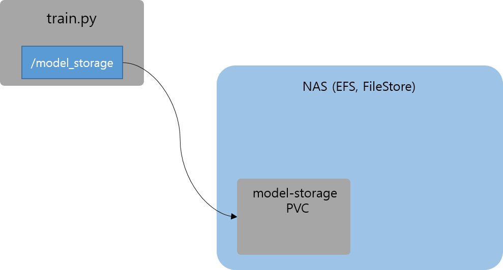

# 2. Save a model file to model storage

NFS storage PVC를 하나 생성합니다. 이름은 `model-storage`라고 정하겠습니다.
앞으로 해당 PVC에 모델 파일들을 저장할 예정입니다.

```bash
# Create model storage PVC
cat <<EOF | kubectl create -f -
apiVersion: v1
kind: PersistentVolumeClaim
metadata:
  name: model-storage
spec:
  accessModes:
  - ReadWriteMany
  resources:
    requests:
      storage: 10Gi
  storageClassName: nfs-storage
EOF
```

PVC 생성후 minio를 통해 생성된 PVC를 확인해 보겠습니다.
```bash
kubectl get svc -nkube-system  # --> external IP 확인
```

모델을 특정 위치에 저장하도록 `train.py`를 수정해 보겠습니다.


