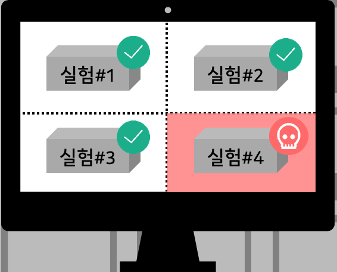

# 3. Exception Handling

### 1. Job 장애
기계학습 job들을 돌리다보면 가끔 문제가 되는 한개 job이 서버 전체를 망가뜨리는 경우가 있습니다.
ML job이 몇개 되지 않으면 사람이 눈으로 직접 확인하거나 리소스 모니터링을 통해 알림을 받게 할 수 있지만 여러개를 학습하다보면 이것을
일일이 확인하기란 쉽지 않습니다.

다행히 쿠버네티스에는 리소스를 컨트롤할 수 있는 메커니즘이 있습니다.
Job을 정의할때 `resources` 필드를 사용하면 됩니다.
이것을 설정하면 특정 잡에서 너무 많은 리소스를 잡아먹을때 그 영향이 서버 전체에 영향을 주지 않고 해당 job만 죽게 만들 수 있습니다.



```yaml
apiVersion: batch/v1
kind: Job
metadata:
  name: handson-03
spec:
  template:
    spec:
      containers:
      - name: ml
        image: $IMAGE
        imagePullPolicy: Always
        command: ["python", "-u", "train.py"]
        args: ['20', 'softmax', '0.5']
        resources:
          requests:            # MIN resource
            cpu: "0.5"
            memory: "3Gi"
          limits:              # MAX resource
            cpu: "1"
            memory: "5Gi"
      restartPolicy: Never
  backoffLimit: 0
```


### 1. 서버 장애

서버 자체에도 장애를 발생 시켜봅시다. (삭제) 
