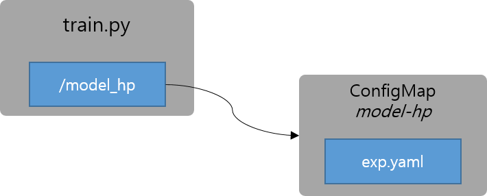

# 4. Training with hyper-parameter

지금까지는 모델 파라미터를 전부 프로세스를 호출하면서 파라미터로 전달하였습니다.
만약에 전달해야할 모델 파라미터의 개수가 엄청 많거나 파일로 모델 파라미터를 관리해야한다면 어떻게 해야할까요?
쿠버네티스의 `ConfigMap`을 이용하여 모델 파라미터를 직접 파일로 마운트해서 사용해 보도록 하겠습니다.



### Creating Hyper Parameter file
```bash
kubectl create configmap model-hp --from-file=exp.yaml=exp.yaml
```

### Editing Hyper Parameters
```bash
kubectl edit configmap model-hp
```
