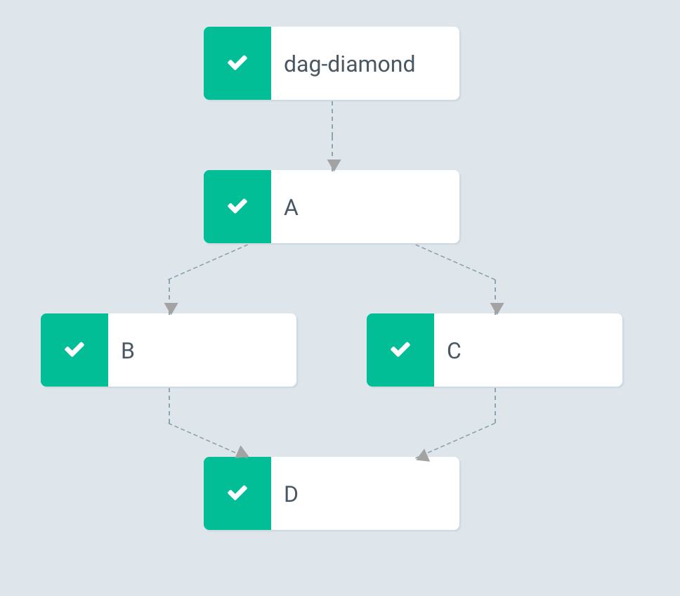
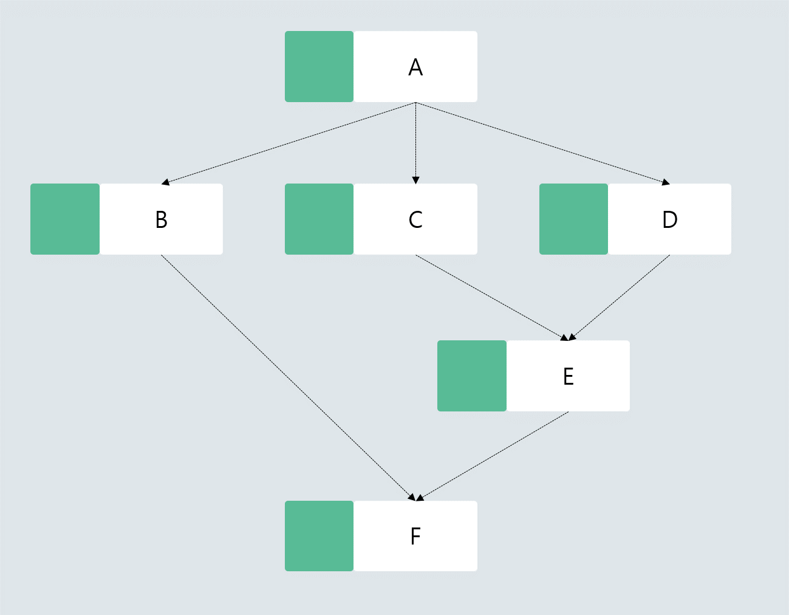

# 8. DAG workflow

순차적 흐름인 steps으로 workflow를 표현하기 힘든 경우, DAG를 이용하여 서로의 dependency를 연결할 수 있습니다. 복잡한 workflow를 만들려고 할때, DAG를 이용하는 편이 차라리 더 낫습니다.

아래의 DAG를 그림으로 표현하지면 다음과 같습니다.
```bash
cat << EOF | kubectl create -f -
apiVersion: argoproj.io/v1alpha1
kind: Workflow
metadata:
  name: handson-08-dag
spec:
  entrypoint: diamond
  templates:
  - name: echo
    inputs:
      parameters:
      - name: message
    container:
      image: alpine:3.7
      command: [echo, "{{inputs.parameters.message}}"]
  - name: diamond
    dag:
      tasks:
      - name: A
        template: echo
        arguments:
          parameters: [{name: message, value: A}]
      - name: B
        dependencies: [A]
        template: echo
        arguments:
          parameters: [{name: message, value: B}]
      - name: C
        dependencies: [A]
        template: echo
        arguments:
          parameters: [{name: message, value: C}]
      - name: D
        dependencies: [B, C]
        template: echo
        arguments:
          parameters: [{name: message, value: D}]
EOF
```




### Do it more

아래와 같은 DAG를 제작해 볼까요?


